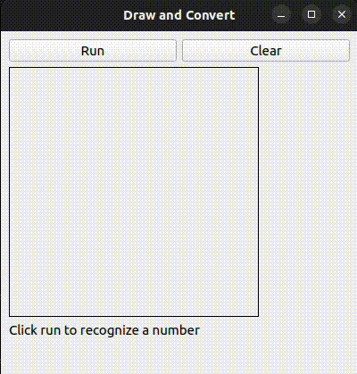
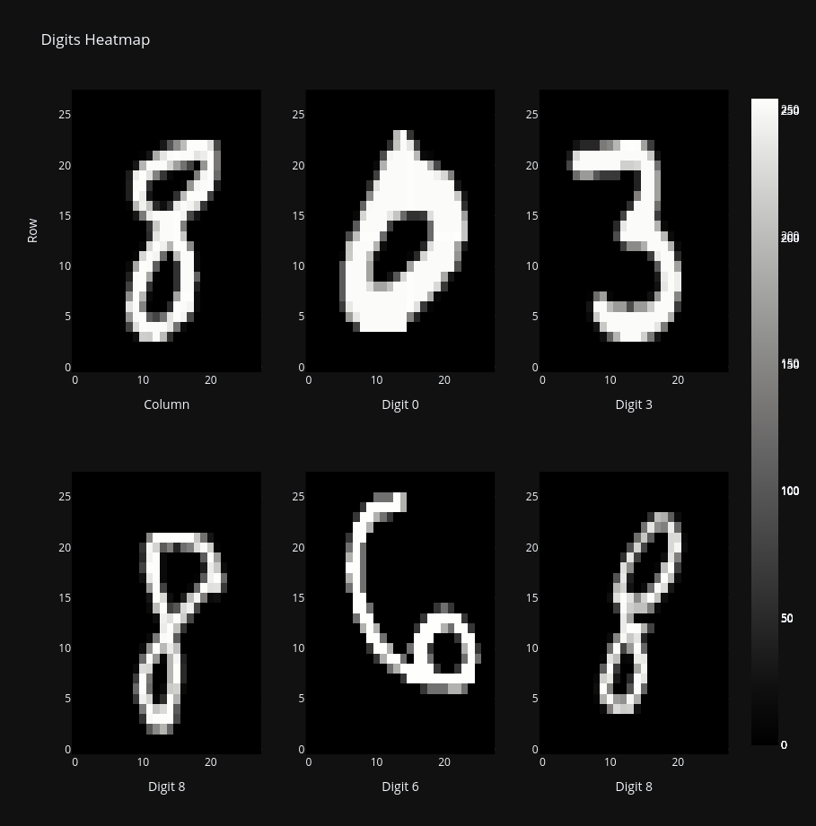
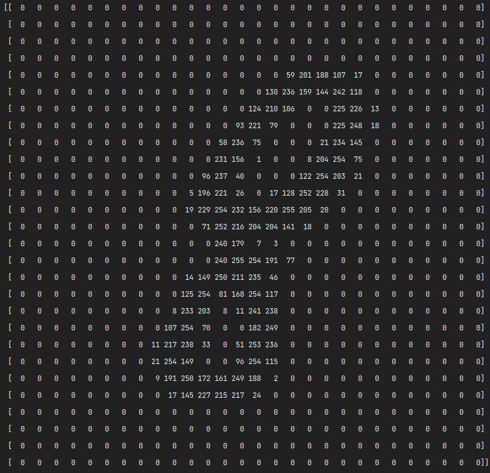
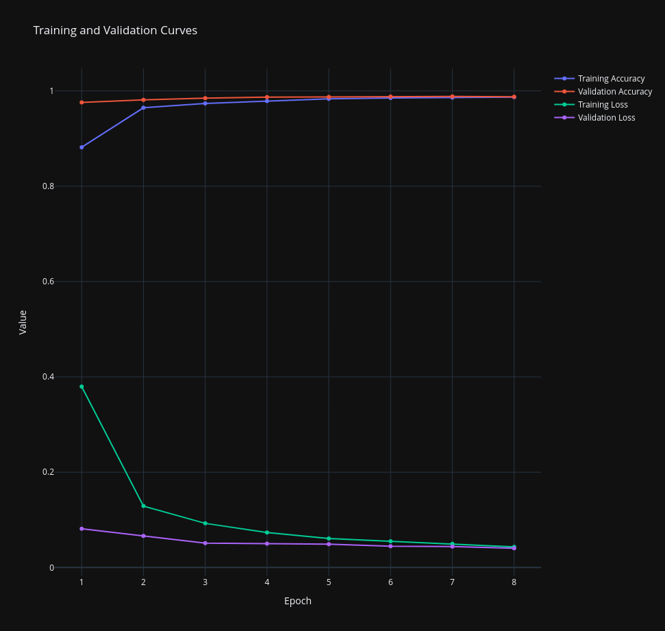
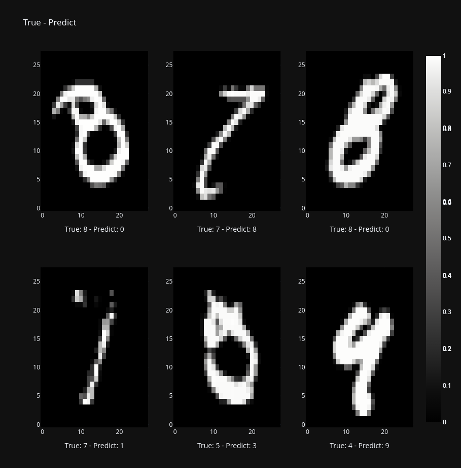

# Digit Classifier App

## Description

The Digit Classifier App is a PyQt5-based application that allows users to draw handwritten digits and classify them using a pre-trained machine learning model. It provides a simple and intuitive interface for recognizing digits.



## Usage

To use the Digit Classifier App:

1. Draw a digit on the drawing area.
2. Click the "Run" button to classify the drawn digit.
3. The recognized digit will be displayed on the screen.

## Training Dataset

The Digit Classifier App was trained using the [MNIST Database](http://yann.lecun.com/exdb/mnist/), a popular dataset of handwritten digits. This dataset consists of 28x28 pixel images of digits (0-9) written by various individuals. It serves as a standard benchmark for digit recognition tasks in machine learning.



### Dataset Details

- Number of Classes: 10 (Digits 0 to 9)
- Image Size: 28x28 pixels
- Pixel Values: Ranging from 0 (white) to 255 (black)
- Total Number of Samples: 60,000 (Training) + 10,000 (Testing)
- Data Format: Matrix with Pixel Values and Heatmap



## Model Architecture

The Digit Classifier App is powered by a Convolutional Neural Network (CNN) model trained to recognize handwritten digits from the MNIST dataset. Here is the model's architecture:

```python
model = Sequential([
    Conv2D(64, (3, 3), activation="relu", input_shape=(28, 28, 1)),
    MaxPooling2D((2, 2)),
    Dropout(0.15),
    Conv2D(128, (3, 3), activation="relu"),
    MaxPooling2D((2, 2)),
    Dropout(0.15),
    Flatten(),
    Dense(64, activation="relu"),
    Dropout(0.2),
    Dense(32, activation="relu"),
    Dropout(0.2),
    Dense(10, activation="softmax")
])
```

## Model Performance

The Digit Classifier App's model achieved impressive accuracy in recognizing handwritten digits. During training, the model's performance was monitored using training and validation curves. Here are the key performance metrics:

- Train Accuracy: 98.72%
- Validation Accuracy: 98.78%
- Train Loss: 0.0432
- Validation Loss: 0.040
- **Test accuracy: 98.84%** 



The training curves indicate that the model learned effectively and did not overfit the data. Both training and validation accuracy increased steadily during training, demonstrating the model's ability to generalize well to new digits.

## Wrong Predictions

It's important to acknowledge that even well-trained models may make incorrect predictions, especially when dealing with handwritten digits. Here are some examples of instances where the model from the MNIST dataset made incorrect predictions:



These examples demonstrate scenarios where the model encountered challenges in recognizing certain digits. It's important to note that digit recognition can be complex, especially with variations in handwriting styles.

## Improvements

As with any machine learning model, there is always room for improvement. If you have ideas or suggestions for enhancing the Digit Classifier App or improving its recognition accuracy, please feel free to contribute to the project or share your feedback.

## Requirements

Before running the Digit Classifier App, ensure you have the following dependencies installed:

- Python 3.x
- PyQt5
- NumPy
- TensorFlow (or TensorFlow-GPU for faster inference)
- Plotly (for visualizing training curves)

You can install the required packages using the following command:

```bash
pip install PyQt5 numpy tensorflow plotly
```
